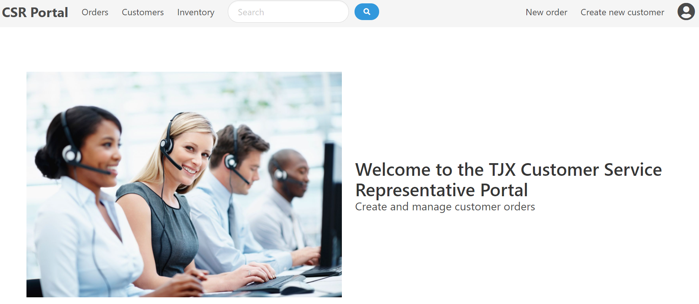
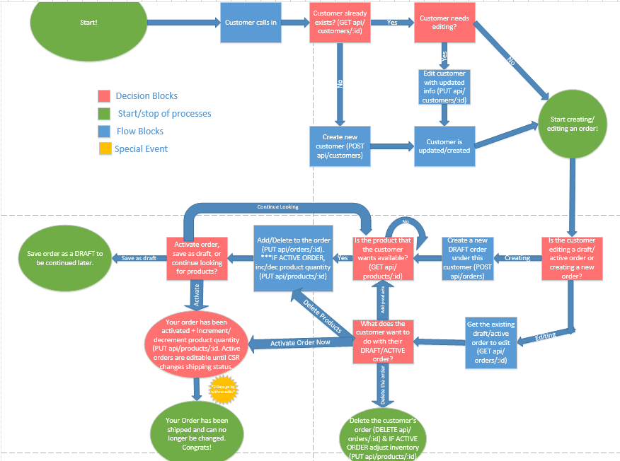
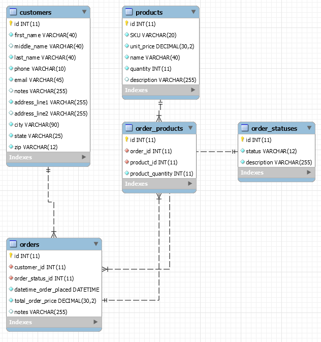
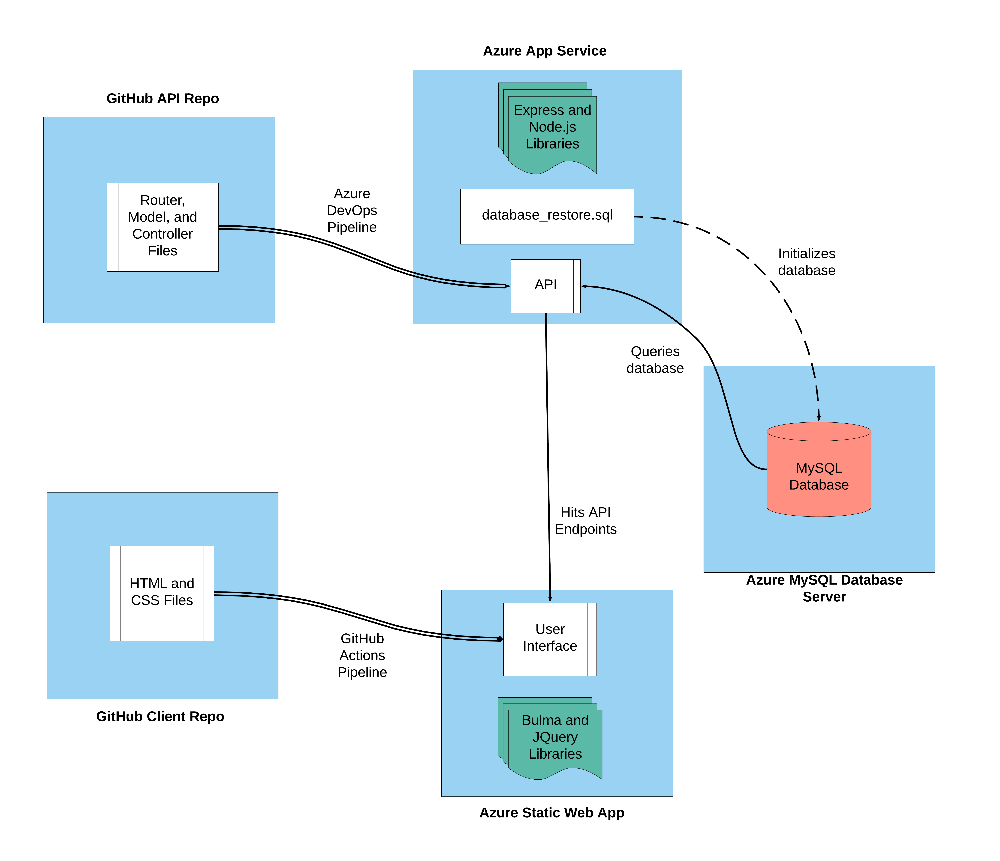

# TJX Engineer I Cohort Training Capstone Project
 
 
## Purpose of the Capstone
* To give the students practical exprience as part of a working dev team. 
* Key technologies to focus on were:
   - Day to day workflow, including source control management
   - API development
   - Database-to-Server interaction (ORM)
   - Standard web development (HTML/CSS/JavaScript)
   - DevOps including CI/CD pipelines

 ## Contributors
* Our capstone started off with two team & two projects. After not too long, we realized how intertwined the teams were working and merged into one team, and one project. Here are the contributors:
* Instructor:
    - Erik Gross
* Engineer Cohort
    - Angelica Puchovsky
    - Apoorva Karpurapu
    - Brandon Wade
    - Cameron Sanborn
    - Corey Byrne
    - Corrin Courville
    - Dominique Mendes
    - James Holden
    - Jeff Louzada
    - Jack Brooks
    - Kevin Hoang
    - Kristin Antone
    - Lavon Burgo
    - Noah Mezher
    - Patrick Gilbert
    - Patrick Kelley
    - Rey Sarmiento
    - Shane Driskell
    - Stephanie Velez
    - Wajih Khawaja

## Description
* Project: Create an "Order Tracking" application in 1 Week
    - Application purpose: Amplifying the productivity of TJX customer service representatives with an efficient CSR portal to best serve customers calling in. Customers will be able to place orders, edit orders, edit their info, or ask about availability of specific products through the CSR using the web application.

## The Process

### Day 1
* Architecture, Planning, & Organization:
    - The first day of our capstone project consisted of laying out every element that a CSR web app should have. We then had to decide what components were the most important, and feasible to complete within our timeframe. Our team was split into subgroups working on different layers of the app including UI/UX, API, Documentation, Database, Models/Controllers, etc.. Each subgroup starting putting together a code skeleton to work from for the rest of the week.

### Day 2
* DevOps, CI/CD, GitHub:
    - The second day was where we started diving into the code, as well as learning to work with a DevOps mindset and central code repository. Using Azure DevOps, each team began to create and assign user stories to be completed. Our first daily stand-up occurred to get a sense of where everyone was heading with their sections. An Azure pipeline was set up for the backend, so any merges that happened with our source of truth in github were automatically built and pushed to a live api.

### Day 3
* Co-Dependencies & Thinking Differently
    - On day 3, a lot of subgroups had a lot of code to show, and now wanted to start connecting all of the layers. The database team gives the API team formatting instructions, who gives the front-end functions to access the database through specific API endpoints. All While DevOps is making sure the automatic builds are successful & begin to think about testing. Everyone realizes that any action taken can affect other parts of the app, so teams start to talk, plan, and flush implementations out from end-to-end. Not only is it now important to know what your team is working on, but to understand the flow of the app as whole, and pushes people to start thinking differently.

### Day 4
* Code, Code, and more Code:
    - As soon as day 4 started, we had a quick stand-up, organized and delegated user stories for the day, and got right to work. With more work in the front-end than expected, everyone begins to lend a hand with the CSS/HTML/JS on the web pages. Nearing the end of the day, numerous hurdles including CORS policies, internal server errors, and API calls are overcome. With the last day coming up, more than half of the cohort volunteer to continue coding after-hours, putting full effort into finishing the project.

### Day 5
* Loose Ends, Presentation, Graduation
    - With the final 3.5 hours, loose ends are tied up. These include documentation, links/searches/displays in the front-end, and consistent style changes. With our final stand-up and stories being taken, the final capstone is coming together.

## Technology stack
* Backend 
    - Express/Node.js
    - API endpoints allowed us to get both individual orders/customers/products, as well as ALL orders/customers/products from the database, and then create new orders/customers/products that are then populated into the database
    - 
* Database
    - MySQL Database
    - 
* Frontend 
    - CSS: [Bulma](https://bulma.io/) for styling 
    - JS: [JQuery](https://jquery.com/) for in-browser javascript
    - Our frontend allows us to navigate through all orders/customers/products and individual orders/customers/products. We also have the ability to create new orders/customers/products, and place certain products into an existing or new order, as well as tying that specific order to a specific customer. Our front end also contains a landing page from which we can navigate to all other pages using a menu bar. We also give users the ability to search through orders/customers/products using a search bar at the top of each page. 
* Environment
    - Source Code Management (SCM) through GitHub
    - Develop Branch is the source of truth
    - A CI/CD pipeline allows us to automatically deploy changes made to the Develop Branch to an Azure app services environment where our site lives
    - API and Database server also live in a different Azure environment, giving us the following architecture:
    - 

## Problems Worked Through
* Coordination
    - Making sure function names are consistent across all parts of the app
    - Keeping track of who is doing what, and managing all Pull Requests

* Working with New Technologies
    - Reading through documentation
    - Understanding dependencies of libraries and their constraints 

* Miscellaneous
    - General bugs and issues
    - Coding is fun!  

## Application breadown
* Each Web Page has a corresponding Javascript page to provide dynamic functionality to each element. The Bulma library was used to style the webpages.
* Various customer, order, and product pages use CRUD operations to perform calls to the API. CRUD operations that you will see implemented:

* Customer CRUD operations:
    - Create a new customer
    - Read a customer by ID (Name, phone #, address, etc)
    - Read all customers
    - Update customer info
    - Delete a customer
* Order CRUD Operations:
    - Create a new order for a customer
    - Read a specific order (order ID, status, products, etc)
    - Read all orders
    - Read all orders for a specific customer
    - Update an exisiting order before shipping
    - Delete an order
* Product CRUD Operations:
    - Read a specific product by ID (quantity, ID, price, more info)
    - Read the products from a specific order
    - Read all products 

* Each CRUD operation is tied to an API endpoint that uses the customer, order, and product controllers alongside the ORM (Object Relational Mapper) to GET, POST, PUT, or DELETE information from the database.
* As a CSR, you will have access to the Customer page to find the customer you are talking to. You can then edit that customer's info, make a new order for that customer, look at that customer's current & past orders, or delete that customer. Whatever the customer wants to do!
* CSRs can also view the current inventory that's available to their customers.
